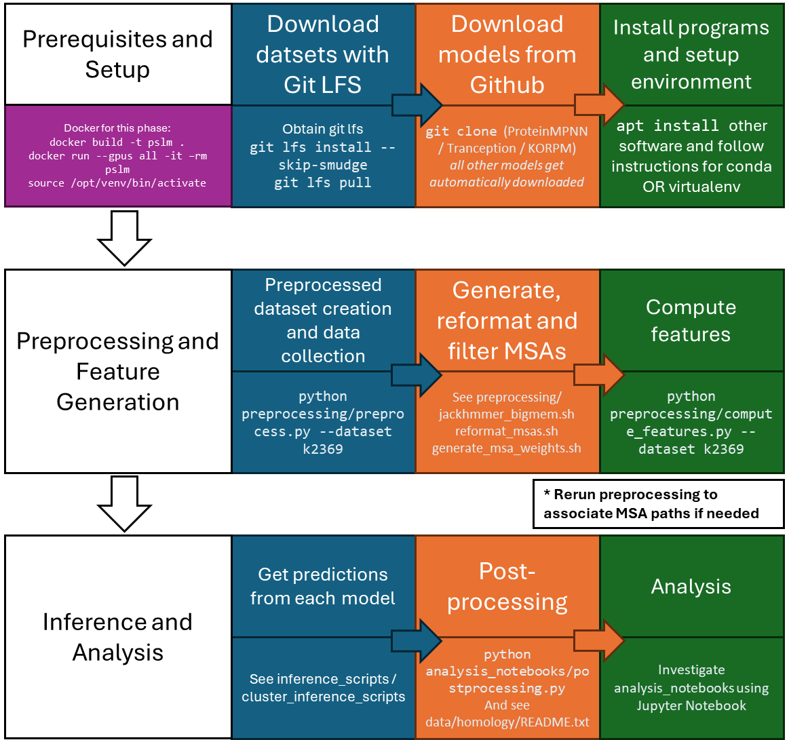

[](https://zenodo.org/doi/10.5281/zenodo.10403302)

# Protein Sequence Likelihood Modelling for Thermostability Prediction

This repository is for facilitating access to and benchmarking self-supervised deep learning models, which predict the likelihood of amino acids in their biochemical context, in order to make zero-shot predictions of thermostability measurements. We refer to these models as **Protein Sequence Likelihood Models**.

# System Requirements

* Linux-based Operating System (any modern Linux distribution should work)
  * tested on GNU/Linux 3.10.0-1160.71.1.el7.x86_64, 4.18.0-477.21.1.el8_8.x86_64
  * tested on WSL2
  * tested on Fedora 38 (cannot use apt here of course)
* NVIDIA GPU (if running inference)
  * tested on A100, RTX 3090
* NVIDIA CUDA (tested v11.4, 12.2) and CUDNN (if running inference)
* High RAM
  * up to 128GB for preprocessing or inference involving MSAs
* ~45 GB of free space (more if using all inference models)
* Docker (optional, community edition (docker-ce) version 24.0.5 tested)
  * Apptainer can be used if Docker is not allowed on clusters, tested version 1.2.4  		
* Anaconda / Python 3.8 (tested)
  * dependencies included in requirements.txt (additionally requirements_inference.txt for running inference)
* HMMER (if generating MSAs, tested version 3.2.1)
* Git LFS (if examining or analyzing reported data, including re-running notebooks)
* MMSeqs2 (if doing sequence clustering, version 13-45111+ds-2 tested)
* FATCAT (if doing structure clustering, version ef787fe tested)
* DSSP (if calculating surface area features for analysis, version 4.04 tested)
* Rosetta (if doing biophysical stability prediction, used version 2019.21.60746)

# Demo /  Instructions

You can use the Jupyter notebooks from the analysis_notebooks folder to reproduce the figures, **modifying the path at the start of the file if needed** and running each cell sequentially. 

In this case, most of the overhead is not needed, just complete the general setup and run the notebooks. They draw from precomputed features, the original databases from their respective authors, and predictions generated on a high-performance compute cluster (also tested on RTX 3090). All of these data sources are included in the repository, and instructions for reproducing the predictions and features are provided below. 

We recommend demoing the more thoroughly documented and tidy analysis_notebooks/k2369_analysis.ipynb; the other notebooks are fully functional and show how other figures are generated but are not as well documented . The expected outputs are shown below the cells. The expected runtimes are often included per-cell, for a total runtime of <5 minutes on a typical PC. To reduce the demo time, the number of bootstrapped replicates have been greatly reduced from those reported in the text. Additionally, the ensemble predictions step has been precomputed and is loaded from a file, but can be easily reproduced by uncommenting the relevant line(s).

# Summary Diagram



# Installation Guide - Prerequisites and Setup

ℹ️ Only general setup is required to demo analysis notebooks.

The expected installation time for basic functionality is >10 minutes, assuming you only install the first requirements.txt. Approximately 45 minutes is required to install all CUDA / CUDNN / Pytorch, inference_requirements and auxiliary software (which the Docker setup does) but depends on internet connection. Similarly, installation time for tested models for inference depends on the internet connection speed, as some models are many GiB in size. A full Docker-based demo, including image creation, data preprocessing for one dataset, and inference using one model, may take as long as 90 minutes (mostly for downloading models and packages).

The sections after general setup are for reproducing the experiments starting from raw data.

### Docker Setup 
ℹ️ **This section is the easiest option for running inference and completely reproducing the analyses. Creating the image may take upwards of an hour.**

⚠️⏬ **If you are only interested in demoing notebooks, skip to the General Setup section.**

⚠️ **If you experience issues with Nvidia drivers and Docker, note that we used the community edition: https://docs.docker.com/engine/install/ubuntu/**

1. Clone the repository:
```
git clone https://github.com/skalyaanamoorthy/PSLMs.git
cd PSLMs
```
2. Inspect the Dockerfile. The Modeller download section in particular depends on your system architecture.
   * Modify the wget command according to your compute architecture and operating system (e.g. `uname -m`)
     * See https://salilab.org/modeller/download_installation.html
   * Modify `convenience_scripts/append_modeller_paths.sh` to match
     * This step is required to associate the paths Modeller uses so that the virtual environment is aware of it 
   * :warning: **Modify the KEY_MODELLER=XXXX part of the command** substituting XXXX with a valid Modeller license key which can be obtained for free for academic use
   * Comment out this section if you don't need Modeller or want to install it separately (or bind it from your system)
  
3. Optionally comment out other software you don't need

4. From the root of the repository (takes ~30 minutes):
```
sudo usermod -aG docker $USER # if not already done
docker build -t pslm .
```

5. Run the container with GPU support. On the clusters we used, this required porting to apptainer. Follow a) for Docker, b) for Apptainer
	
 	a) Directly run the image using Docker:

	`docker run --gpus all -it --rm pslm`

	b)
	* Port the image to apptainer:
	```
 	docker save pslm_image -o pslm_image.tar
 	apptainer build --fakeroot pslm_image.sif docker-archive://pslm_image.tar
 	```
 
 	* Upload the image to the cluster and load any modules e.g. `module load apptainer`
  	* Run the image with GPU support and with an overlay image to write files to (adjust size as needed, default 1 GB):
	```
 	apptainer overlay create --fakeroot --size 1024 overlay.img
 	apptainer shell --fakeroot --overlay overlay.img --nv pslm_image.sif
	```

6. **Skip to step 3 of Preprocessing ("Skip to here if using Docker") in this README**

### General Setup 
ℹ️ **This section is required for all uses of the repository, if not using Docker.**

⚠️⏬ **Skip to the preprocessing section if using Docker.**

We provide the processed predictions for Q3421, FireProtDB, Ssym and S461 in `./data/analysis/{dataset}_analysis.csv`. However, to reproduce the predictions you can follow the below sections for preprocessing and inference. We also provide the pre-extracted features for analysis in the corresponding `./data/features/{dataset}_mapped_local_feats.csv` files, but you can reproduce those according to the feature analysis section. They are already integrated into the analysis csv files.

1. Clone the repository:
```
git clone https://github.com/skalyaanamoorthy/PSLMs.git
cd PSLMs
```

2. If you want to also download all associated data, you may need to obtain GitLFS. Then:
```
git lfs install --skip-smudge
git lfs pull
```

3. Setup the virtual environment using either a) conda or b) VirtualEnv. *If you have root permissions (ability to sudo) you should use conda, as it will make future steps faster and easier. Otherwise you can use VirtualEnv.
   
	a) If you choose to use conda: To install with conda on a cluster, you might need to `module load anaconda` and/or `module load python` first. Then:
	```
	conda create --name pslm python=3.8
	conda activate pslm
	conda install -c conda-forge notebook
	```
	b) If you instead choose to use virtualenv: On a cluster, you might need to `module load python` first:
	```
	virtualenv pslm
	source pslm/bin/activate
	```

4. You can then install the pip requirements (if only performing inference (not preprocessing and analysis), you can skip this). On the ComputeCanada cluster, you will have to comment out pyarrow and cmake dependencies and load the arrow module instead with `module load arrow`. You will also have to use the --no-deps flag.

	`pip install -r requirements.txt`

5. Finally, install evcouplings with no dependencies (it is an old package which will create conflicts):

	`pip install evcouplings --no-deps`

ℹ️ ✔️ **You can now proceed directly to run the demo analysis_notebooks/q3421_analysis.ipynb if you are demoing analysis only.**

### Inference Setup
ℹ️ **This section is to install the deep learning libraries and predictive models used to generate the likelihood (or stability) predictions.**

⚠️⏬ **Skip to the preprocessing section if using Docker.**

If you have a sufficient NVIDIA GPU (tested on 3090 and A100) you can make predictions with the deep learning models.

1. Start by installing CUDA if you have not already: https://docs.nvidia.com/cuda/cuda-installation-guide-linux/index.html. At time of writing you will need to get CUDA 11.X in order to be able to install the torch-* requirements. If you are on a cluster, make sure you have the cuda module loaded e.g. `module load cuda` as well as any compiler necessary e.g. `module load gcc`, `module load rust`. If you are using WSL2, you should be able to just use `sh ./convenience_scripts/cuda_setup_wsl.sh`. MIF-ST also requires cuDNN: https://docs.nvidia.com/deeplearning/cudnn/install-guide/index.html.

2. Install Pytorch according to the instructions: https://pytorch.org/get-started/locally/ . In some cases, it will suffice to `pip install torch`, but you must take care to match your CUDA version. On the ComputeCanada cluster, there may be dependency issues between the numpy and torch versions. In this case, since Modeller cannot be installed anyway, we suggest that preprocessing be performed locally, followed by only installing the requirements_inference on the cluster environment.
	
 	`pip install torch`

3. Finally, you can install the inference-specific requirements (approx 2 minutes total on a GPU):

	`pip install -r requirements_inference.txt --no-deps`

4. Install evcouplings separately if you haven't already:

	`pip install evcouplings --no-deps`

5. You will also need to install the following inference repositories if you wish to use these specific models:

	a) ProteinMPNN:

	`git clone https://github.com/dauparas/ProteinMPNN`
	
	Note: ProteinMPNN directory will be used as input for ProteinMPNN scripts; it will need to be specified when calling the Python script (--mpnn_loc).

	b) Tranception:

	`git clone https://github.com/OATML-Markslab/Tranception`

	Follow the instructions in the repo to get the Tranception_Large (parameters) binary and config. You do not need to the setup the conda environment.
	Again, you will need to specify the location of the repository (--tranception_loc) and the model weights (--checkpoint).

	c) KORPM (note: statistical potential, not PSLM). ⚠️ Make sure to have Git LFS in order to obtain the potential maps used by KORPM, otherwise you can download the repository as a .zip and extract it. You will need to compile KORPM with the GCC compiler.
	```
	git clone https://github.com/chaconlab/korpm
	cd korpm/sbg
	sh ./compile_korpm.sh
 	```
	Like the above methods, there is a wrapper script in inference_scripts where you will need to specify the installation directory with the argument --korpm_loc.


# Preprocessing and Feature Generation

## Preprocessing

ℹ️ **This section is for downloading and preprocessing the structures, sequences, and alignments used for inference.**

⏬🚩 **Skip to step 3 if using Docker**

In order to perform inference you will first need to download and preprocess the structures and sequences. Follow the above instructions before proceeding. Note that you will need to preprocess ALL DATASETS including data/external_datasets/cdna117k.csv and rosetta_training_data.csv to run analysis_notebooks/postprocessing.py without errors.

1. Obtain Modeller (for repairing PDB structures): https://salilab.org/modeller/download_installation.html You will need a license, which is free for academic use; follow the download page instructions to make sure it is specified. 

	a) Assuming you are using conda:
	```
	conda config --add channels salilab
	conda install modeller
	```

	b) Assuming you are using virtualenv:
	* To make modeller visible to the Python scripts from within the VirtualEnv, you can append to your `./pslm/bin/activate` file following the pattern shown in `convenience_scripts/append_modeller_paths.sh`:
	`sh convenience_scripts/append_modeller_paths.sh`
	**Ensure to replace the modeller version and system architecture as required (you can find these with `uname` and `uname -m` respectively). Then make sure to restart the virtualenv**:
	`source pslm/bin/activate`

2. Unzip MSAs and weights. MSA Transformer and Tranception require multiple sequence alignments which we have already generated. Full MSAs used by Tranception are too large to include in a GitHub repository (its performance is very similar with these reduced MSAs), please reach out to us if you need the full MSAs.
```
unzip ./data/preprocessed/msas.zip -d ./data/preprocessed/msas
unzip ./data/preprocessed/weights.zip -d ./data/preprocessed/weights 
```

🚩 **Skip to here if using Docker**

*If using Docker: make sure your virtual environment is activated `source /opt/venv/bin/activate` and you are in the correct directory `cd /app`*

3. To run inference you will need to preprocess the mutants in each database, obtaining their structures and sequences and modelling missing residues. You can accomplish this with preprocess.py.  Assuming you are in the base level of the repo, you can call the following:

	`python preprocessing/preprocess.py --dataset q3421`

	This step is expected to take ~10 minutes each for the two larger datasets (Q3421 and K2369) and updates the file `./data/preprocessed/{dataset}_mapped.csv`.

5. Repeat this with the other datasets you intend to run inference on e.g. k3822, s669, s461, fireprot, etc.
   
6. **If running demo: Skip to Inference and Analysis section.** 

#### Notes:

---

* Add the --internal_path argument to specify a different repo location to look for inputs/outputs for the repository where the calculations will be run, for instance if preprocessing locally and then running inference on the cluster
* Note that the output dataframe `./data/preprocessed/q3421_mapped.csv` is already generated, but the other files are not prepared.
* You can also use a custom database for inference. The preprocessing script will facilitate making predictions (and MSAs) with all methods by collecting the corresponding UniProt sequence (if available) as well as modelling, preprocessing, and validating all structures as required. To use this functionality, you can create a csv file with columns for code (PDB ID) chain (chain in PDB structure), wild_type (one letter code for wild-type identity at mutated position), position (corresponds to the PDB-designated index), and mutation (one-letter code), with as many rows as desired. Then run preprocessing pointing to the database and giving it a desired name which will appear in the prefix:

	`python preprocessing/preprocess.py --dataset MY_CUSTOM_NAME --db_loc ./data/my_custom_dataset.csv`

For example, to preprocess the cdna117k set included in the external data:

	`python preprocessing/preprocess.py --db_loc ./data/external_datasets/cdna117K.csv --dataset cdna117k --indexer sequential_id`
Where the --indexer argument is used to indicate that the index is this dataset is derived from the position in the corresponding sequence, rather than the default choice, which would be the pdb_id

---

### Generate, Reformat and Filter MSAs

 *(Optional)* If you want to regenerate the MSAs, you can use the scripts found in preprocessing:
* `jackhmmer_bigmem.sh` to generate the MSAs (one dataset at a time, requires the preprocessed database and the UniRef100 database)
* `reformat_msas.sh` changes from the Stockholm format of JackHMMER to a3m used by MSA Transformer and Tranception. Also performs filtering by coverage and identity for MSA Transformer
* `generate_msa_weights.sh` creates the sequence weights used by Tranception

Make sure your MSAs match the expected location designated in the data/preprocessed/{dataset}_mapped.csv file so that they can be used by MSA Transformer and Tranception. Again, for MSA Transformer, you need to generate subsampled alignments with using inference_scripts/subsample_one.py (according to the template given in cluster inference scripts).

## Feature Generation
ℹ️ **This subsection calculates features of the data which are used extensively in the analysis notebooks. You can run this section before or after running inference.**

⚠️⏬  **This section is NOT required for running inference. You can skip directly to the Inference section if your data has been successfully preprocessed.**

⚠️**You MUST run the preprocessing scripts to generate the correct file mappings for your system.**

For analysis based on features, you can compute the features using preprocessing/compute_features.py. Note that the features have been precomputed and appear in `./data/features/{dataset}_mapped_feats.csv`:
You will need the following tools to help recompute features:

1. AliStat (for getting multiple sequence alignment statistics): https://github.com/thomaskf/AliStat
```
git clone https://github.com/thomaskf/AliStat
cd AliStat
make
```

2. DSSP (for extracting secondary structure and residue accessibility): https://github.com/cmbi/dssp

	`sudo apt install dssp`
	OR

	`git clone https://github.com/cmbi/dssp` and follow instructions.

3. Finally, you can run the following to compute the features. 

	`python3 preprocessing/compute_features.py --alistat_loc ./AliStat`

It is expected that there will be some errors in computing features. However, if you see that DSSP did not produce an output, this is an issue with the DSSP version. Make sure you have version 4, or else install via GitHub. AliStat might fail for large alignments if you do not have enough RAM; we have read only the first 100,000 lines for large files to try to mitigate this. Remember that the features have been pre-computed for your convience as stated above, and any missing features can be handled by merging with our dataframes.

### Clustering Analysis
ℹ️ **This subsection is for computing the homology between sequences and structures for the purposes of understanding and mitigating the overlap of training and test sets as well as effectively bootstrapping or computing statistics based on structurally homologous protein families.**

⚠️ **You will need to preprocess ALL DATASETS including data/external_datasets/cdna117k.csv and rosetta_training_data.csv in order to obtain their sequences and structures if you want them to be included in these homology analyses**

1. Sequence analysis requires mmseqs2, installed via:

	`sudo apt install mmseqs2`

2. Sequence similarity was done using
```
cd  ./data/homology
mmseqs createdb ../all_seqs.fasta sequencesDB
mmseqs createindex sequencesDB tmp --threads 8
mmseqs search sequencesDB sequencesDB resultDB tmp --threads 8 -s 9.5 -e 0.1
mmseqs convertalis sequencesDB sequencesDB resultDB result.m8
```

3. Structure similarity was done using FATCAT, installed via:
```
git clone https://github.com/GodzikLab/FATCAT-dist.git
./Install
```

4. Actual homology searching was done using (after preprocessing)
```
cd ./structures/single_chains/
export FATCAT=/home/sareeves/software/FATCAT-dist
~/software/FATCAT-dist/FATCATMain/FATCATQue.pl timeused ../../data/all_pairs.txt -q > allpair.aln
```

# Inference and Analysis

## Running Inference (Get predictions from each model)
ℹ️ **This section shows the general workflow for rendering (likelihood/stability) predictions from one model.**

⚠️**You MUST run the preprocessing scripts to generate the correct file mappings for your system, or else always run inference from the root of the repo. If you run into problems with missing files when running inference, this is probably why. You also need to install requirements_inference.txt**

0. MSA Transformer depends on subsampled alignments. We provide the script `inference_scripts/subsample_one.py` associated with `cluster_inference_scripts/subsample_msas_{dataset}.sh` to facilitate creating these subsamples. Note that the choice of sample may impact MSA Transformer's performance slightly. The aforementioned scripts generate all subsampled MSAs in parallel and are appropriate for clusters. For desktop environments, you can generate subsampled MSAs during inference by adding the argument `--do_subsampling` to `inference_scripts/msa_transformer.py`.

1. You can run any of the inference scripts in inference_scripts. You can copy commands from the associated `cluster_inference_scripts` for convenience and prototypes. Note that ProteinMPNN and Tranception require the location where the GitHub repository was installed as arguments. e.g.:

	`python inference_scripts/mpnn.py --db_loc 'data/preprocessed/q3421_mapped.csv' --output 'data/inference/q3421_mapped_preds.csv' --mpnn_loc ./ProteinMPNN --noise '20'`

	This step is expected to take <2 minutes and should update the designated output file.

⚠️ **Due to the use of relative paths in the _mapped.csv, you must call inference scripts from the root of the repository! Again, note that you must specify the install location for ProteinMPNN, Tranception, and KORPM because they originate from repositories.**

You can use the template calls from cluster_inference_scripts in order to determine the template for calling each method's wrapper script (they are designed to be called from the cluster_inference_scripts directory, though). If you are running on a cluster, you will likely find it convenient to modify the `cluster_inference_scripts` and directly submit them; they are designed to be submitted from their own folder as the working directory, rather than the root of the repo like all other files. Note that each method will require substantial storage space and network usage to download the model weights on their first run (especially ESM-1V and ESM-15B).


## Postprocessing and Analysis
ℹ️ **This step synthesizes all data computed until this point. At minimum, you need to complete the preprocessing of all datasets for this to work, since it also synthesizes the homology / dataset overlap**

⚠️**You will need to preprocess ALL DATASETS to run analysis_notebooks/postprocessing.py without errors.** 

⚠️**It is not recommended to try to run the Jupyter Notebooks from a Docker instance**

1. When new predictions, features, clusters etc. have been created run:
	`python3 analysis_notebooks/postprocessing.py`

2. Run any of the analysis notebooks using Jupyter Notebook (tested in VSCode server). Reduce bootstraps if calculations are taking too long.


